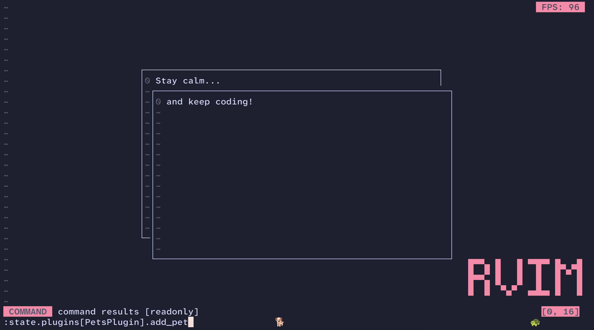

# RVim

A work in progress NeoVim clone written in Ruby.

RVim is a terminal text editor meant for editing code. It is designed to be extremely extensible with a built-in Ruby REPL and a plugin system.

Use RVim at your own risk. It has numerous bugs (that I know of) and it will possibly modify your files in ways you won't expect. All APIs and implementation details are subject to change.
